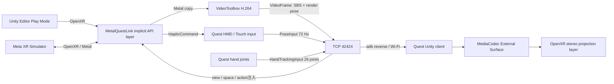

# MetalQuestLink

[English](README.md) | 日本語（このページ） | [コントリビューション](CONTRIBUTING.md) |
[セキュリティ](SECURITY.md) | [Apache-2.0](LICENSE)

Apple Silicon MacのUnity Editor Play ModeをMeta Quest 3 / 3Sでプレビューするための開発ツールです。
Meta XR SimulatorをMac側OpenXR runtimeとして使い、implicit OpenXR API layerが左右眼映像をQuestへ送り、
QuestのHMD・Touch入力をUnityへ差し戻します。

主要機能とOSS公開準備を実装済みです。Mac/Simulator回帰に加え、Quest 3実機で映像・入力・左右26関節の
ハンドトラッキング・パススルー・通信ハプティクス経路を検証済みです。詳細は
[実装進捗](docs/progress.md) を参照してください。

## 利用に必要なもの

- Apple Silicon Mac（arm64）
- macOS 14以降（検証環境: macOS 26.4.1）
- Unity 2022.3 LTS以降（対応baseline: `2022.3`、package検証: `6000.2.5f1` / `6000.3.6f1`、実機stream検証: `6000.2.5f1` / `6000.3.6f1`）とAndroid Build Support（SDK / NDK / OpenJDKを含む）
- [Meta XR Simulator](https://developers.meta.com/horizon/documentation/unity/xrsim-getting-started/) Standalone macOS ARM版 v201以降
  - 既定の配置: `/Applications/MetaXRSimulator.app`
- Android platform-toolsの`adb`
  - 既定の探索先: Unity Android SDK、`/opt/homebrew/bin/adb`、`/usr/local/bin/adb`
- developer modeとUSB debuggingを有効にしたQuest 3 / 3S

配布packageにはビルド済みnative layerとQuest APKが含まれるため、利用者側のCMake、Xcode、
Homebrewは不要です。初回のUnity package解決にはネットワーク接続が必要です。Meta XR Core SDKは
配布Editor packageの必須依存ではありません。repository同梱sample / Quest clientをsourceから開く場合だけ、
`https://npm.developer.oculus.com` の公式registryから`203.0.0`を取得します。

sourceから開発・release作成する場合だけ、CMake 3.25以降、AppleClang、Gitが必要です。

## アーキテクチャ



映像はUnity textureへ戻さず、VideoToolboxからMediaCodec、Meta compositorのAndroid Surface swapchainへ渡します。
各VideoFrameに含まれるMac描画時の左右眼pose/FOVとside-by-sideの左右領域をOpenXR projection layerへ直接提出します。
映像は視野全体を覆う一人称ステレオ表示となり、受信後の頭部移動はQuest compositorが再投影します。
必要なOpenXR拡張がないruntimeでだけ、従来のQuad表示へfallbackします。

## Quest機能対応状況

| 機能 | 状態 | 実装と制約 |
|---|---|---|
| HMD / Touch Plus入力 | 対応 | pose、click / touch、thumbstick、trigger、gripを最新値優先で送信 |
| コントローラハプティクス | 対応 | `xrApplyHapticFeedback` / `xrStopHapticFeedback`の左右、振幅、周波数、持続時間をQuestへ転送。mock E2E済み、実機振動は未確認 |
| ハンドトラッキング | 対応 | `XR_EXT_hand_tracking`の左右26関節、radius、有効／追跡flagを60 Hz以上で送信。Quest 3実機で52関節と開閉追従を確認。任意の関節／bone診断表示も搭載 |
| パススルー | 近似対応 | alpha/additive blendまたはsource-alpha layerを検出し、Quest Passthrough underlayと固定uniform alpha `0.82`の映像overlayで合成。Quest 3実機でunderlay表示を確認 |
| シーンアンカー | 対応外 | protocol拡張余地のみ |
| 空間メッシュ | 対応外 | protocol拡張余地のみ |
| アイ／フェイストラッキング | 対応外 | Quest 3 / 3S対象のため実装しない |

パススルー近似はH.264映像の画素ごとのalphaを保持しません。透明領域を正確に復元する方式ではなく、
Mac側で透過合成の要求を検出したフレーム全体へalpha `0.82`を適用してunderlayを見せます。
HEVC with alphaはQuest MediaCodecでの対応を実機検証できず、protocol v1では採用していません。

## ゼロからPlayするまで

### 1. 配布物を入手する

releaseの次の2ファイルをdownloadします。`VERSION`と`SHA256SUMS`を使うとdownload後の内容を検証できます。

- `com.metalquestlink.editor-0.2.0.tgz`: Unity package、arm64 layer、Quest APKを含む
- `MetalQuestLink-0.2.0.apk`: Quest APK単体

```sh
cd <download directory>
shasum -a 256 -c SHA256SUMS
```

### 2. Unity projectへEditor packageを導入する

UnityのPackage Managerで **Add package from tarball...** を選び、downloadした
`com.metalquestlink.editor-0.2.0.tgz` を指定します。git URLを使う場合は **Add package from git URL...**
へ次を指定します。

```text
https://github.com/KouyamaCreate/MetalQuestLink.git?path=editor-package#v0.2.0
```

repositoryをcloneした開発環境では **Add package from disk...** で
`editor-package/package.json`を選べます。動作確認用の`samples/MetaXRMinimal`には
`OVRCameraRig`、左右grabber、掴めるcubeが含まれます。

packageを読み込むと、native layer manifestが次へ自動登録されます。

```text
~/.local/share/openxr/1/api_layers/implicit.d/XrApiLayer_metalquestlink.json
```

### 3. doctorを実行する

repository同梱scriptを使える場合は次を実行します。packageのarm64 binary、署名、version、layer登録、
Simulator、adb、Quest接続、端末APK versionを日本語で検査します。Quest未接続とSimulator停止は警告、
package不整合やadb欠落はerrorです。

```sh
scripts/doctor.sh
# Unityをまだ1度も開いておらず、manifestだけ登録したい場合
scripts/doctor.sh --register
```

tarballだけを受け取った場合も、展開先を`--package-root`へ渡せます。通常はUnityがpackage load時に
layerを自動登録するため、Unityの **Window > MetalQuestLink** でも状態を確認できます。

### 4. Questを接続し、APKをinstallする

1. QuestをUSB接続し、headset内のUSB debugging確認を許可します。
2. `adb devices` で状態が`device`になっていることを確認します。
3. Unityで **Window > MetalQuestLink** を開きます。
4. **Quick Setup (Project + Quest)** を1回押します。

APK pathやadb pathが自動検出できない場合は同じwindowで指定します。

### 5. Playする

1. `/Applications/MetaXRSimulator.app` を起動します。
2. UnityのStandalone XR providerがOpenXRであることを確認します。packageは初回load時にStandaloneだけをOpenXRへ自動設定し、Android側のOculus / OpenXR loaderは変更しません。
3. UnityのPlayボタンを押します。

Play直前にpackageがlayer登録、`adb reverse tcp:42424 tcp:42424`、Quest client起動を行います。
MetalQuestLink windowが`Waiting for connection`から`Connected`へ変わり、fpsとMac側copy/encode時間を表示します。
GUIから起動したUnityにもMeta XR Simulatorのruntime JSONを自動設定します。自動検出できない場合は
`Window > MetalQuestLink`で`OpenXR runtime JSON`を指定し、`Configure Standalone OpenXR`を押してください。

APKのbuildとinstallは初回導入またはMetalQuestLink更新時だけです。通常のPlayではAndroid buildを行わず、
インストール済みQuest clientを起動してEditorの描画を即時streamします。`Window > MetalQuestLink` の
`Passthrough preview`と`Show tracked hands`で、Play時のパススルーと診断用hand skeletonを切り替えられます。

### プロジェクトごとの差を設定する

**Window > MetalQuestLink** はPlay前にUnity version、Standalone OpenXR、Simulator runtime、native layer、
portと配信設定を検査します。`Run Project Check`で詳細を確認できます。自動設定はStandaloneの既存XR loaderを
削除せず、OpenXRを先頭へ移して他のloaderをfallbackとして残します。AndroidのXR設定は変更しません。

- `Quest serial`: 複数のadb端末がある場合だけ対象Questのserialを指定
- `Runtime JSON path` / `APK path` / `adb path`: 絶対パス、またはUnity project root基準の相対パス
- `Wi-Fi fallback host`: USB reverseに接続できない場合に試すMacのIP address
- `Bitrate Mbps`: `0`は左右眼の合計解像度から8〜40 Mbpsを自動選択。手動時は1〜80 Mbps
- `Max pending frames`: VideoToolbox待ちの上限。既定`2`で、超過時は遅延を積まずframeをdrop

描画側はSingle Pass Instanced等の同一2D-array swapchainと、Multi Pass等の左右別2D swapchainの両方を扱います。
BGRA8 / RGBA8 / RGB10A2 / BGR10A2 / BGR10_XR / RGBA16Float系のMetal textureを8-bit BGRAへ変換して配信します。

新規利用者の通常操作は「tarball導入 → Quick Setup → Play」の3段階です。

## 接続と診断

USB接続ではQuest clientが`127.0.0.1:42424`へ接続し、adb reverseがMacのlistenerへ転送します。
clientは任意のWi-Fi hostもfallbackに設定できます。製品既定portは`42424`、mock E2E専用portは
テスト間干渉を避けるため`42425`です。

実機の自動診断は次で実行します。

```sh
scripts/e2e_device.sh
```

このscriptはAPK install、adb reverse、無装着用power automation、起動、stream、logcat判定、後片付けを行い、
receive/decode 30 fps以上、PoseInput 60 Hz以上、immersive projection mode、clock sync、hand sample、haptic受信、
passthrough underlayを要求します。成功時は`capture_to_decode_ms`も出力します。実機未接続なら変更を加えず
exit code 2で終了します。

## レイテンシ計測

計測点は次のとおりです。

| 指標 | 始点 → 終点 | clock |
|---|---|---|
| `averageCopyMs` | Mac `xrEndFrame` hook → Metal copy / RGBA変換完了 | Mac monotonic |
| `averageEncodeMs` | Metal blit完了 → VideoToolbox callback | Mac monotonic |
| `capture_to_receive_ms` | Mac capture → Quest TCP受信 | Ping/Pong補正済み |
| `capture_to_decode_ms` | Mac capture → MediaCodec outputをSurfaceへrelease | Ping/Pong補正済み |
| `clock_rtt_ms` | Quest Ping → Mac Pong → Quest | Quest monotonic |

MacとQuestのmonotonic epochは異なるため、Questが1秒ごとにPingを送り、Macが受信時刻付きPongを返します。
Questは往復中央時刻から`host - client` offsetを推定します。

Apple M4 Pro / Meta XR Simulator 201.0.0 / 3360x1760 SBS H.264のPhase 6回帰runでは、
120-frame時点で平均Metal copy `1.83 ms`、平均VideoToolbox encode `15.58 ms`、合計`17.41 ms`、
mock decode `76.26 fps`でした。最終配布APKのQuest 3実機E2Eではreceive最大`74 fps`、decode最大`76 fps`、
Pose最大`73 Hz`、健全なstream中の`capture_to_decode_ms`は`140.498283 ms`でした。
ここでいうdecode値はcompositor Surfaceへのreleaseまでであり、光学的motion-to-photon値ではありません。

## releaseを作る

開発者は次の1 commandでnative Release build、ctest、Quest APK build、ad-hoc署名、package同期、
配布物作成、checksum検証まで実行できます。

```sh
scripts/build_release.sh
```

`dist/`には次の4種類が生成されます。

- `com.metalquestlink.editor-<version>.tgz`
- `MetalQuestLink-<version>.apk`
- `SHA256SUMS`
- `VERSION`

versionの正本は`editor-package/package.json`です。`editor-package/VERSION`とQuest clientの
`bundleVersion`も同じ値にします。HEADにtagがある場合、`build_release.sh`は`v<semver>`との一致を
必須にします。公開時は配布binaryをpackageへ同期したcommitへ、たとえば`v0.2.0`を付けます。

```sh
scripts/build_release.sh
git add editor-package
git commit -m "build: package MetalQuestLink 0.2.0"
git tag v0.2.0
scripts/build_release.sh
(cd dist && shasum -a 256 -c SHA256SUMS)
```

既存build成果物だけでpackage構造を検査する短い回帰と、repository外のUnity projectでtarballを
検査する完全回帰は次です。

```sh
scripts/test_phase7.sh
scripts/test_phase7_clean.sh
```

後者は一時directoryへsample projectを複製し、tarball経由でpackageを解決してEditMode testと
Simulator PlayMode E2Eを行います。これによりrepository内の`build/`や`quest-client/Builds/`への
暗黙依存がないことを確認します。

### 署名、Gatekeeper、公証

配布buildはnative layerへ`codesign -s -`のad-hoc署名を行います。downloadしたtarballに
`com.apple.quarantine`が付きmacOSに拒否された場合は、取得元とchecksumを確認したうえで
package cacheまたは展開したpackageだけから属性を外し、再検証します。

```sh
xattr -dr com.apple.quarantine <MetalQuestLink package directory>
codesign --verify --strict --verbose=2 \
  <MetalQuestLink package directory>/Native~/macOS/libmetalquestlink_openxr_layer.so
```

必要なら **システム設定 > プライバシーとセキュリティ** で拒否履歴を確認します。repository全体や
`~/Library`全体へ再帰的に`xattr`を実行しないでください。

公開配布をApple Developer IDで公証する場合は、ユーザー所有の証明書とnotary profileで次を行います。
このcredentialはrepositoryやCI logへ保存しません。

```sh
codesign --force --timestamp --options runtime \
  --sign "Developer ID Application: <name> (<team-id>)" \
  editor-package/Native~/macOS/libmetalquestlink_openxr_layer.so
ditto -c -k --keepParent editor-package/Native~/macOS/libmetalquestlink_openxr_layer.so layer.zip
xcrun notarytool submit layer.zip --keychain-profile <profile> --wait
```

### CI

`.github/workflows/native.yml`はGitHub-hosted `macos-15` arm64 runnerでCMake build、ctest、architecture、
署名を検証します。`.github/workflows/quest-apk.yml`は手動起動のAPK buildです。Unity licenseが必要なため、
repositoryのActions secretsへ次を登録してから有効化します。

- Personal: `UNITY_LICENSE`（`.ulf`内容）、`UNITY_EMAIL`、`UNITY_PASSWORD`
- Pro: 上記workflowを`UNITY_SERIAL`方式へ変更し、`UNITY_EMAIL`、`UNITY_PASSWORD`とともに登録

APK workflowはGameCI Unity Builder v4を使い、成功したAPKをartifactとして保存します。

## 開発用の全検証

```sh
cmake -B build
cmake --build build -j8
ctest --test-dir build --output-on-failure
scripts/test_phase1.sh
scripts/test_phase2.sh
scripts/test_phase3.sh
scripts/test_quest_client.sh
scripts/build_quest_client.sh
scripts/test_phase5.sh
scripts/test_phase7.sh
scripts/test_phase7_clean.sh
scripts/test_phase8.sh
scripts/test_unity_matrix.sh
# Quest実機を接続した場合
scripts/e2e_device.sh
```

- `test_phase1.sh`: Meta XR Simulator Metal frame loopとlayer load
- `test_phase2.sh`: 未接続pass-through、H.264 encode/decode 30 fps以上
- `test_phase3.sh`: 映像、合成HMD/controller/hand入力注入、haptic、passthrough近似、Ping/Pong clock sync
- `test_quest_client.sh`: C# protocol、transport、clock換算、左右眼projection pose/FOV、Quest機能mappingのEditMode test
- `test_phase5.sh`: Editor packageとsampleのMeta XR Simulator PlayMode E2E
- `test_phase7.sh`: 配布4点、checksum、repository外展開、doctor
- `test_phase7_clean.sh`: tarballだけを使うrepository外Unity/Simulator E2E
- `test_phase8.sh`: Phase 0〜8全回帰。Quest未接続時はdevice E2Eだけを保留扱いにする
- `test_unity_matrix.sh`: 同じEditor packageをUnity 2022.3 / 6000.2 / 6000.3の一時projectで解決し、互換性testとcompile error不在を確認

## トラブルシューティング

### layerがloadされない

- `scripts/doctor.sh`でpackage内`Native~/macOS/libmetalquestlink_openxr_layer.so`と署名を確認します。
- source開発時だけ`build/layer/libmetalquestlink_openxr_layer.so`も確認します。
- **Window > MetalQuestLink > Register OpenXR Layer** を押します。
- manifestの`library_path`が現在のrepositoryを指しているか確認します。
- `METALQUESTLINK_DISABLE_API_LAYER` が設定されていれば解除します。
- layer logはUnity projectの`Library/MetalQuestLink/layer.log`です。

### Questが接続されない

- `adb devices` が1台の`device`を返すか確認します。`unauthorized`ならheadset内で許可します。
- `adb reverse tcp:42424 tcp:42424` を再実行します。
- Mac側で `lsof -nP -iTCP:42424` を確認します。
- 複数SDKのadb serverが競合した場合は、同じadb binaryでserverを再起動します。

### Play ModeでOpenXRが起動しない

- Meta XR Simulatorを先に起動します。
- UnityのStandalone OpenXR loaderを有効にします。
- Metal sessionにはgraphics deviceが必要です。CIのPlayMode検証へ`-nographics`を付けないでください。
- `XR_RUNTIME_JSON`を使う場合はSimulator bundle内の
  `Contents/Resources/MetaXRSimulator/meta_openxr_simulator.json`を指定します。

### 映像が出ない、fpsが低い

- MetalQuestLink windowの接続、fps、copy/encode時間、drop数、stream解像度を確認します。
- Quest logcatの`METALQUESTLINK_DIAGNOSTIC`を確認します。
- `Bitrate Mbps = 0`では解像度に合わせて8〜40 Mbpsを選びます。Mac負荷やWi-Fi品質が不足する場合は
  USBを使い、bitrateまたはUnity側のrender scaleを下げます。`Dropped frames`だけが増える場合はMac側の
  copy/encodeが追いついていません。
- QuestでMediaCodec low-latency keyが使えない場合は通常modeへ自動fallbackします。

## 既知の制約

- 対象はApple Silicon、Quest 3 / 3S、Unity 2022.3 LTS以降です。package compile / EditMode互換性と実機streamは6000.2 / 6000.3で検証しています。2022.3はresolver baselineですが、local license未有効のためmatrix実行は未確認です。
- 現在の公開想定binaryはad-hoc署名で、Apple Developer ID公証済みではありません。download経路によってはGatekeeper対応が必要です。
- Quest 3実機E2EでMediaCodec Surface release、実fps / pose rate、capture-to-decode、hand message、haptic command受信、Passthrough設定を確認済みです。
- Quest 3装着時に一人称projection表示、左右hand modelの開閉追従、Passthrough underlayを目視確認済みです。
  Touch振動の体感とMacが高負荷な場合の映像品質は追加確認が必要です。
- パススルーは固定uniform alpha近似で、画素alpha、black key、premultiplied alpha、HEVC alphaには対応しません。
- projection layerはMac描画時の左右眼pose/FOVを使うcompositor再投影です。depth-aware / spacewarpではありません。
- Metal以外のgraphics API、2D / 2D-array以外のtexture、上記対応表にないpixel formatは配信対象外です。
- Play中にeye texture解像度またはcodecが変わる動的切替には未対応です。render scaleはPlay開始前に決めてください。
- protocol v1のcontroller poseはgrip/aimで共通、IPDはMac側注入時に64 mm固定です。
- clock offsetはPing/Pongの往復対称性を仮定する近似で、光学測定の代替ではありません。
- Meta XR Simulator v201はprocess終了時にvendor gRPC destructorが待機する場合があります。native testだけは
  OpenXR resource破棄後にvendor static destructorを迂回します。

詳細設計は [仕様](docs/spec.md)、実測値は [調査メモ](docs/notes.md)、Phase 7の配布結果は
[Phase 7レポート](docs/phase7-report.md)、全フェーズの結果は [最終レポート](docs/final-report.md)、
実装順は [plan](docs/plan.md) を参照してください。

## OSSとしての参加とライセンス

バグ報告、互換性情報、ドキュメント修正、範囲を絞ったPull Requestは英語・日本語のどちらでも歓迎します。
投稿前に [CONTRIBUTING.md](CONTRIBUTING.md) と [CODE_OF_CONDUCT.md](CODE_OF_CONDUCT.md) を確認してください。
脆弱性は公開Issueへ書かず、[SECURITY.md](SECURITY.md) のprivate vulnerability reportingを利用してください。

プロジェクトが作成したソースコードとドキュメントは [Apache-2.0](LICENSE) です。SDK、生成binary、商標など
第三者要素にはそれぞれのライセンスと規約が適用されます。詳細は
[THIRD_PARTY_NOTICES.md](THIRD_PARTY_NOTICES.md) を参照してください。

MetalQuestLinkは独立したOSSであり、Meta、Unity Technologies、Apple、OpenAIによる公式製品、承認、
スポンサー提供ではありません。
