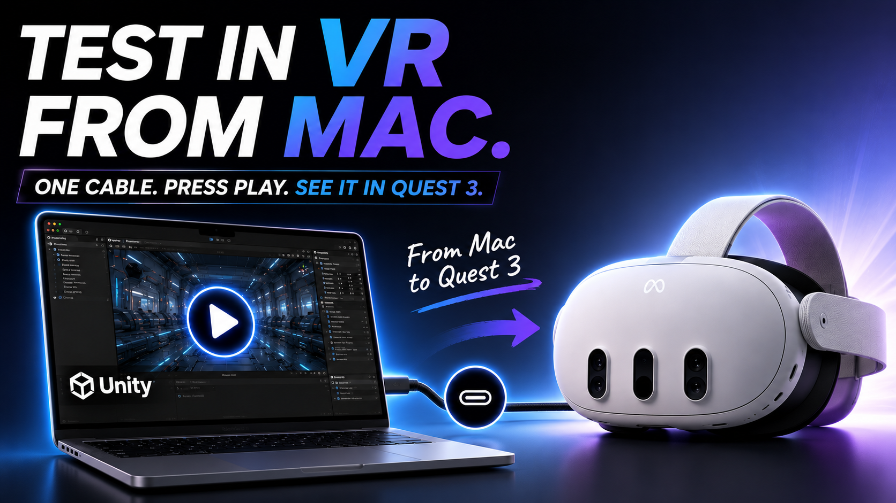
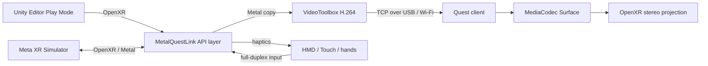

# MetalQuestLink

[日本語](README.ja.md) · [Documentation](docs/README.md) · [Contributing](CONTRIBUTING.md) ·
[Security](SECURITY.md) · [Apache-2.0](LICENSE)

[](https://youtu.be/pVmj9CtD0LU)

**[▶ Watch the 89-second MetalQuestLink demo on YouTube](https://youtu.be/pVmj9CtD0LU)**

Stream Unity Editor Play Mode from an Apple Silicon Mac to Meta Quest 3 or 3S without rebuilding
an Android app for every iteration.

MetalQuestLink combines Meta XR Simulator, an implicit OpenXR API layer, Metal, VideoToolbox, and a
prebuilt Quest client. The headset displays a first-person stereo projection while sending HMD,
Touch controller, and hand-tracking input back to the Unity Editor.

> Project status: working developer preview. The native layer, Unity package, Simulator path, and
> Quest 3 device path have been exercised, but the current macOS binary is ad-hoc signed and not
> notarized. Read [Known limitations](#known-limitations) before adopting it in production.

## Why MetalQuestLink?

A small XR scene or interaction change normally triggers an Android build, install, and launch
cycle. MetalQuestLink keeps the project in macOS Unity Editor Play Mode and turns the headset into a
low-latency preview target.

- No CMake, Xcode, or Quest-client rebuild for normal installation
- First-person stereo projection with compositor reprojection
- HMD, Touch input, 26 hand joints per hand, and haptic command forwarding
- USB `adb reverse` by default, with an optional Wi-Fi fallback
- Single-pass array and per-eye swapchains across common Metal texture formats
- Capability-based project preflight instead of a hard dependency on one Unity patch release
- A self-contained UPM tarball, Quest APK, checksums, doctor command, and clean-room package test

## Built with Codex and GPT-5.6

Codex with GPT-5.6 accelerated the repository-wide work: tracing native and Unity integration,
removing patch-version assumptions, implementing Quick Setup and compatibility tests, and keeping
the implementation, OSS documentation, and Devpost submission material aligned. Codex and GPT-5.6
also helped produce the recent public demo video: building its capture scene and motion, shaping the
under-three-minute edit and narration, and preparing the recording workflow and checklist.
Architectural decisions, hardware results, the final edit, and submission choices remain
human-reviewed and are recorded in this repository.

Build Week Codex sessions:

- `019f618b-15a8-7960-962b-7433a62ce98f` — core MetalQuestLink implementation and verification
- `019f8322-1489-7022-b234-617ef5e38478` — Unity compatibility, installation, OSS, and submission work
- `019f836b-b8d9-7da3-82f2-a3001423e828` — public demo video production

## Supported environment

| Component | Support |
|---|---|
| Host | Apple Silicon Mac, macOS 14 or newer |
| Headset | Meta Quest 3 / 3S with Developer Mode and USB debugging |
| Unity baseline | Unity 2022.3 LTS or newer |
| Verified package matrix | Unity 6000.2.5f1 and 6000.3.6f1 |
| Verified headset streaming | Unity 6000.2.5f1 and 6000.3.6f1 on Quest 3 |
| OpenXR runtime | Meta XR Simulator standalone macOS arm64 v201 or newer |

Unity 2022.3 is the package resolver baseline, but its local test-matrix run is still pending a
licensed Editor in the verification environment. See the [compatibility policy](docs/compatibility.md)
for the distinction between supported and verified versions.

## Quick start (no rebuild)

### Prerequisites

- Unity with Android Build Support, including SDK, NDK, and OpenJDK
- [Meta XR Simulator](https://developers.meta.com/horizon/documentation/unity/xrsim-getting-started/)
- Android platform-tools (`adb`)
- A developer-mode Quest 3 or 3S with USB debugging enabled

### Install and run

1. Download these files from the matching [GitHub release](https://github.com/KouyamaCreate/MetalQuestLink/releases):
   - `com.metalquestlink.editor-0.2.0.tgz`
   - `MetalQuestLink-0.2.0.apk` (also embedded in the UPM package)
   - `SHA256SUMS`
2. Verify the download:

   ```sh
   cd <download-directory>
   shasum -a 256 -c SHA256SUMS
   ```

3. In Unity, select **Window > Package Manager > + > Add package from tarball...** and choose
   `com.metalquestlink.editor-0.2.0.tgz`.
4. Connect the Quest over USB and accept the debugging prompt in the headset.
5. Open **Window > MetalQuestLink** and click **Quick Setup (Project + Quest)**.
6. Start Meta XR Simulator, then press Play in Unity.

Quick Setup configures Standalone OpenXR without deleting existing fallback loaders, registers the
native layer, installs the bundled Quest APK, and prepares `adb reverse`. Normal Play sessions reuse
that installed client and do not rebuild Android.

For a source checkout, the package can also be added from `editor-package/package.json`. After this
repository is published and tagged, its Git URL has this form:

```text
https://github.com/KouyamaCreate/MetalQuestLink.git?path=editor-package#v0.2.0
```

## Architecture



The video path stays out of Unity textures after capture: VideoToolbox feeds MediaCodec, which
releases frames to an Android Surface swapchain submitted as an OpenXR stereo projection layer.
Each frame carries the render-time eye poses and FOV. Quest compositor reprojection handles headset
movement after reception.

## Feature status

| Feature | Status | Notes |
|---|---|---|
| HMD and Touch input | Supported | Pose, buttons, touch, sticks, trigger, and grip |
| Hand tracking | Supported | `XR_EXT_hand_tracking`, 26 joints per hand; 52 active joints verified on Quest 3 |
| Controller haptics | Supported path | Apply/stop commands are transported; physical vibration feel still needs validation |
| Passthrough | Approximation | Passthrough underlay plus uniform video alpha `0.82`; per-pixel alpha is not preserved |
| Scene anchors / spatial mesh | Not supported | Outside protocol v1 scope |
| Eye / face tracking | Not supported | Quest 3 / 3S are the current targets |

## Diagnostics

From a source checkout:

```sh
scripts/doctor.sh
scripts/doctor.sh --register  # register the manifest before Unity has loaded the package
```

The doctor checks architecture, signature, package and APK versions, layer registration, Simulator,
`adb`, and connected-device state. A disconnected Quest or stopped Simulator is a warning; a
missing package component or `adb` is an error.

For device automation:

```sh
scripts/e2e_device.sh
```

This installs the APK, configures USB forwarding, starts the client, validates stream/input
diagnostics, and exits with code 2 without changing the device when no Quest is connected.

## Build and test from source

End users do not need the following toolchain. Contributors building native code or release
artifacts need CMake 3.25+, AppleClang, Git, and Unity's Android toolchain.

```sh
cmake -B build
cmake --build build -j8
ctest --test-dir build --output-on-failure

scripts/test_phase3.sh          # native video/input/protocol integration
scripts/test_quest_client.sh    # Quest client EditMode tests
scripts/test_phase5.sh          # Unity and Simulator integration
scripts/test_phase7.sh          # release-package structure and checksums
scripts/test_phase7_clean.sh    # clean external-project tarball E2E
scripts/test_unity_matrix.sh    # Unity package compatibility matrix
```

Build all release artifacts with:

```sh
scripts/build_release.sh
```

Detailed test coverage and hardware requirements are documented in
[CONTRIBUTING.md](CONTRIBUTING.md). Recorded implementation results are under [docs/](docs/README.md).

## Performance reference

The recorded Quest 3 E2E run reached peak diagnostics of 74 received frames/s, 76 decoded
frames/s, and 73 pose samples/s. `capture_to_decode_ms` was 140.498283 ms in a healthy portion of
that run. This endpoint is MediaCodec Surface release, not display scanout, so it must not be read
as optical motion-to-photon latency. These measurements describe one test environment and are not
performance guarantees.

## Known limitations

- The distributed macOS layer is currently ad-hoc signed, not Developer ID signed or notarized.
- Unity 2022.3 satisfies the package baseline but is not yet in the locally verified matrix.
- Passthrough uses a uniform-alpha approximation and does not retain per-pixel alpha.
- Dynamic eye-texture resolution or codec changes during Play are not supported.
- Controller grip and aim share the protocol v1 pose, and injected IPD is currently fixed at 64 mm.
- The latency clock offset assumes approximately symmetric Ping/Pong transport time.
- Metal is the only supported host graphics API.

The [Japanese README](README.ja.md) contains the full setup, Gatekeeper, tuning, troubleshooting,
and test-reference guide.

## Contributing

Bug reports, compatibility results, documentation fixes, and focused pull requests are welcome in
English or Japanese. Read [CONTRIBUTING.md](CONTRIBUTING.md) before opening a pull request and follow
the [Code of Conduct](CODE_OF_CONDUCT.md).

Please do not use public issues for vulnerabilities. Follow [SECURITY.md](SECURITY.md) and use
GitHub private vulnerability reporting.

## License and third-party software

Project-authored source and documentation are licensed under [Apache-2.0](LICENSE). Third-party
software, SDKs, trademarks, and bundled components remain subject to their respective licenses and
terms; see [THIRD_PARTY_NOTICES.md](THIRD_PARTY_NOTICES.md).

MetalQuestLink is an independent open-source project. It is not affiliated with, endorsed by, or
sponsored by Meta, Unity Technologies, Apple, or OpenAI.
