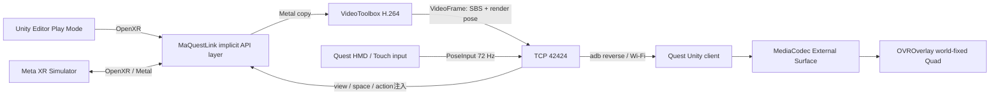

# MaQuestLink

Apple Silicon MacのUnity Editor Play ModeをMeta Quest 3 / 3Sでプレビューするための開発ツールです。
Meta XR SimulatorをMac側OpenXR runtimeとして使い、implicit OpenXR API layerが左右眼映像をQuestへ送り、
QuestのHMD・Touch入力をUnityへ差し戻します。

現在はPhase 7まで実装済みです。Quest実機を使わないMac/Simulator E2Eは自動検証済みです。
Quest APKのbuildも成功していますが、この開発環境にはQuest 3が接続されていないため、実機表示と
capture-to-decode遅延の最終実測だけは未完了です。詳細は [実装進捗](docs/progress.md) を参照してください。

## 利用に必要なもの

- Apple Silicon Mac（arm64）
- macOS 14以降（検証環境: macOS 26.4.1）
- Unity `6000.3.6f1` とAndroid Build Support（SDK / NDK / OpenJDKを含む）
- [Meta XR Simulator](https://developers.meta.com/horizon/documentation/unity/xrsim-getting-started/) Standalone macOS ARM版 v201以降
  - 既定の配置: `/Applications/MetaXRSimulator.app`
- Android platform-toolsの`adb`
  - 既定の探索先: Unity Android SDK、`/opt/homebrew/bin/adb`、`/usr/local/bin/adb`
- developer modeとUSB debuggingを有効にしたQuest 3 / 3S

配布packageにはビルド済みnative layerとQuest APKが含まれるため、利用者側のCMake、Xcode、
Homebrewは不要です。初回のUnity package解決にはネットワーク接続が必要です。Meta XR Core SDKは
`https://npm.developer.oculus.com` の公式registryから`203.0.0`を取得します。

sourceから開発・release作成する場合だけ、CMake 3.25以降、AppleClang、Gitが必要です。

## アーキテクチャ



映像はUnity textureへ戻さず、VideoToolboxからMediaCodec、Meta compositorのExternal Surfaceへ渡します。
各VideoFrameにはMacが描画した左右眼pose/FOVが含まれます。Quest側はそのrender poseへQuadをworld固定し、
受信後の頭部移動をQuest compositorの再投影で補正します。このworld-fixed modeが既定です。

## ゼロからPlayするまで

### 1. 配布物を入手する

releaseの次の2ファイルをdownloadします。`VERSION`と`SHA256SUMS`を使うとdownload後の内容を検証できます。

- `com.maquestlink.editor-0.1.0.tgz`: Unity package、arm64 layer、Quest APKを含む
- `MaQuestLink-0.1.0.apk`: Quest APK単体

```sh
cd <download directory>
shasum -a 256 -c SHA256SUMS
```

### 2. Unity projectへEditor packageを導入する

UnityのPackage Managerで **Add package from tarball...** を選び、downloadした
`com.maquestlink.editor-0.1.0.tgz` を指定します。git URLを使う場合は **Add package from git URL...**
へ次の形式を指定します（`<owner>`は公開repositoryのownerに置き換えます）。

```text
https://github.com/<owner>/MaQuestLink.git?path=editor-package#v0.1.0
```

repositoryをcloneした開発環境では **Add package from disk...** で
`editor-package/package.json`を選べます。動作確認用の`samples/MetaXRMinimal`には
`OVRCameraRig`、左右grabber、掴めるcubeが含まれます。

packageを読み込むと、native layer manifestが次へ自動登録されます。

```text
~/.local/share/openxr/1/api_layers/implicit.d/XrApiLayer_maquestlink.json
```

### 3. doctorを実行する

repository同梱scriptを使える場合は次を実行します。packageのarm64 binary、署名、version、layer登録、
Simulator、adb、Quest接続、端末APK versionを日本語で検査します。Quest未接続とSimulator停止は警告、
package不整合やadb欠落はerrorです。

```sh
scripts/doctor.sh
# Unityをまだ1度も開いておらず、manifestだけ登録したい場合
scripts/doctor.sh --register
```

tarballだけを受け取った場合も、展開先を`--package-root`へ渡せます。通常はUnityがpackage load時に
layerを自動登録するため、Unityの **Window > MaQuestLink** でも状態を確認できます。

### 4. Questを接続し、APKをinstallする

1. QuestをUSB接続し、headset内のUSB debugging確認を許可します。
2. `adb devices` で状態が`device`になっていることを確認します。
3. Unityで **Window > MaQuestLink** を開きます。
4. **Install Quest APK** を1回押します。

APK pathやadb pathが自動検出できない場合は同じwindowで指定します。

### 5. Playする

1. `/Applications/MetaXRSimulator.app` を起動します。
2. UnityのStandalone XR providerがOpenXRであることを確認します。sampleは設定済みです。
3. UnityのPlayボタンを押します。

Play直前にpackageがlayer登録、`adb reverse tcp:42424 tcp:42424`、Quest client起動を行います。
MaQuestLink windowが`Waiting for connection`から`Connected`へ変わり、fpsとMac側copy/encode時間を表示します。

新規利用者の通常操作は「tarball導入 → APK install → Play」の3段階です。

## 接続と診断

USB接続ではQuest clientが`127.0.0.1:42424`へ接続し、adb reverseがMacのlistenerへ転送します。
clientは任意のWi-Fi hostもfallbackに設定できます。製品既定portは`42424`、mock E2E専用portは
テスト間干渉を避けるため`42425`です。

実機の自動診断は次で実行します。

```sh
scripts/e2e_device.sh
```

このscriptはAPK install、adb reverse、無装着用power automation、起動、stream、logcat判定、後片付けを行い、
receive/decode 30 fps以上、PoseInput 60 Hz以上、world-fixed mode、clock syncを要求します。成功時は
`capture_to_decode_ms`も出力します。実機未接続なら変更を加えずexit code 2で終了します。

## レイテンシ計測

計測点は次のとおりです。

| 指標 | 始点 → 終点 | clock |
|---|---|---|
| `averageCopyMs` | Mac `xrEndFrame` hook → Metal blit完了 | Mac monotonic |
| `averageEncodeMs` | Metal blit完了 → VideoToolbox callback | Mac monotonic |
| `capture_to_receive_ms` | Mac capture → Quest TCP受信 | Ping/Pong補正済み |
| `capture_to_decode_ms` | Mac capture → MediaCodec outputをSurfaceへrelease | Ping/Pong補正済み |
| `clock_rtt_ms` | Quest Ping → Mac Pong → Quest | Quest monotonic |

MacとQuestのmonotonic epochは異なるため、Questが1秒ごとにPingを送り、Macが受信時刻付きPongを返します。
Questは往復中央時刻から`host - client` offsetを推定します。

Apple M4 Pro / Meta XR Simulator 201.0.0 / 3360x1760 SBS H.264のPhase 6回帰runでは、
120-frame時点で平均Metal copy `1.83 ms`、平均VideoToolbox encode `15.58 ms`、合計`17.41 ms`、
mock decode `76.26 fps`でした。Quest実機の`capture_to_receive_ms` / `capture_to_decode_ms`は未実測です。
ここでいうdecode値はcompositor Surfaceへのreleaseまでであり、光学的motion-to-photon値ではありません。

## releaseを作る

開発者は次の1 commandでnative Release build、ctest、Quest APK build、ad-hoc署名、package同期、
配布物作成、checksum検証まで実行できます。

```sh
scripts/build_release.sh
```

`dist/`には次の4種類が生成されます。

- `com.maquestlink.editor-<version>.tgz`
- `MaQuestLink-<version>.apk`
- `SHA256SUMS`
- `VERSION`

versionの正本は`editor-package/package.json`です。`editor-package/VERSION`とQuest clientの
`bundleVersion`も同じ値にします。HEADにtagがある場合、`build_release.sh`は`v<semver>`との一致を
必須にします。公開時は配布binaryをpackageへ同期したcommitへ、たとえば`v0.1.0`を付けます。

```sh
scripts/build_release.sh
git add editor-package
git commit -m "build: package MaQuestLink 0.1.0"
git tag v0.1.0
scripts/build_release.sh
(cd dist && shasum -a 256 -c SHA256SUMS)
```

既存build成果物だけでpackage構造を検査する短い回帰と、repository外のUnity projectでtarballを
検査する完全回帰は次です。

```sh
scripts/test_phase7.sh
scripts/test_phase7_clean.sh
```

後者は一時directoryへsample projectを複製し、tarball経由でpackageを解決してEditMode testと
Simulator PlayMode E2Eを行います。これによりrepository内の`build/`や`quest-client/Builds/`への
暗黙依存がないことを確認します。

### 署名、Gatekeeper、公証

配布buildはnative layerへ`codesign -s -`のad-hoc署名を行います。downloadしたtarballに
`com.apple.quarantine`が付きmacOSに拒否された場合は、取得元とchecksumを確認したうえで
package cacheまたは展開したpackageだけから属性を外し、再検証します。

```sh
xattr -dr com.apple.quarantine <MaQuestLink package directory>
codesign --verify --strict --verbose=2 \
  <MaQuestLink package directory>/Native~/macOS/libmaquestlink_openxr_layer.so
```

必要なら **システム設定 > プライバシーとセキュリティ** で拒否履歴を確認します。repository全体や
`~/Library`全体へ再帰的に`xattr`を実行しないでください。

公開配布をApple Developer IDで公証する場合は、ユーザー所有の証明書とnotary profileで次を行います。
このcredentialはrepositoryやCI logへ保存しません。

```sh
codesign --force --timestamp --options runtime \
  --sign "Developer ID Application: <name> (<team-id>)" \
  editor-package/Native~/macOS/libmaquestlink_openxr_layer.so
ditto -c -k --keepParent editor-package/Native~/macOS/libmaquestlink_openxr_layer.so layer.zip
xcrun notarytool submit layer.zip --keychain-profile <profile> --wait
```

### CI

`.github/workflows/native.yml`はGitHub-hosted `macos-15` arm64 runnerでCMake build、ctest、architecture、
署名を検証します。`.github/workflows/quest-apk.yml`は手動起動のAPK buildです。Unity licenseが必要なため、
repositoryのActions secretsへ次を登録してから有効化します。

- Personal: `UNITY_LICENSE`（`.ulf`内容）、`UNITY_EMAIL`、`UNITY_PASSWORD`
- Pro: 上記workflowを`UNITY_SERIAL`方式へ変更し、`UNITY_EMAIL`、`UNITY_PASSWORD`とともに登録

APK workflowはGameCI Unity Builder v4を使い、成功したAPKをartifactとして保存します。

## 開発用の全検証

```sh
cmake -B build
cmake --build build -j8
ctest --test-dir build --output-on-failure
scripts/test_phase1.sh
scripts/test_phase2.sh
scripts/test_phase3.sh
scripts/test_quest_client.sh
scripts/build_quest_client.sh
scripts/test_phase5.sh
scripts/test_phase7.sh
scripts/test_phase7_clean.sh
# Quest実機を接続した場合
scripts/e2e_device.sh
```

- `test_phase1.sh`: Meta XR Simulator Metal frame loopとlayer load
- `test_phase2.sh`: 未接続pass-through、H.264 encode/decode 30 fps以上
- `test_phase3.sh`: 映像、合成HMD/controller入力注入、Ping/Pong clock sync
- `test_quest_client.sh`: C# protocol、transport、clock換算、world-fixed poseのEditMode test
- `test_phase5.sh`: Editor packageとsampleのMeta XR Simulator PlayMode E2E
- `test_phase7.sh`: 配布4点、checksum、repository外展開、doctor
- `test_phase7_clean.sh`: tarballだけを使うrepository外Unity/Simulator E2E

## トラブルシューティング

### layerがloadされない

- `scripts/doctor.sh`でpackage内`Native~/macOS/libmaquestlink_openxr_layer.so`と署名を確認します。
- source開発時だけ`build/layer/libmaquestlink_openxr_layer.so`も確認します。
- **Window > MaQuestLink > Register OpenXR Layer** を押します。
- manifestの`library_path`が現在のrepositoryを指しているか確認します。
- `MAQUESTLINK_DISABLE_API_LAYER` が設定されていれば解除します。
- layer logはUnity projectの`Library/MaQuestLink/layer.log`です。

### Questが接続されない

- `adb devices` が1台の`device`を返すか確認します。`unauthorized`ならheadset内で許可します。
- `adb reverse tcp:42424 tcp:42424` を再実行します。
- Mac側で `lsof -nP -iTCP:42424` を確認します。
- 複数SDKのadb serverが競合した場合は、同じadb binaryでserverを再起動します。

### Play ModeでOpenXRが起動しない

- Meta XR Simulatorを先に起動します。
- UnityのStandalone OpenXR loaderを有効にします。
- Metal sessionにはgraphics deviceが必要です。CIのPlayMode検証へ`-nographics`を付けないでください。
- `XR_RUNTIME_JSON`を使う場合はSimulator bundle内の
  `Contents/Resources/MetaXRSimulator/meta_openxr_simulator.json`を指定します。

### 映像が出ない、fpsが低い

- MaQuestLink windowの接続、fps、copy/encode時間を確認します。
- Quest logcatの`MAQUESTLINK_DIAGNOSTIC`を確認します。
- 現在のencoderはH.264 Main、20 Mbps、3360x1760相当を想定します。Wi-Fi品質が不足する場合はUSBを使います。
- QuestでMediaCodec low-latency keyが使えない場合は通常modeへ自動fallbackします。

## 既知の制約

- 対象はApple Silicon、Quest 3 / 3S、Unity 6000.3.6f1で検証した構成です。
- 現在の公開想定binaryはad-hoc署名で、Apple Developer ID公証済みではありません。download経路によってはGatekeeper対応が必要です。
- Quest実機でのMediaCodec External Surface表示、実fps/pose rate、capture-to-decode値はこの環境では未実測です。
- world-fixed Quadはrender head poseを使うcompositor再投影です。depth-aware / spacewarpではありません。
- 映像は左右眼が同じBGRA 2D-array swapchainであるUnity/Simulator構成を前提にします。
- protocol v1のcontroller poseはgrip/aimで共通、IPDはMac側注入時に64 mm固定です。
- clock offsetはPing/Pongの往復対称性を仮定する近似で、光学測定の代替ではありません。
- Meta XR Simulator v201はprocess終了時にvendor gRPC destructorが待機する場合があります。native testだけは
  OpenXR resource破棄後にvendor static destructorを迂回します。

詳細設計は [仕様](docs/spec.md)、実測値は [調査メモ](docs/notes.md)、Phase 7の配布結果は
[最終レポート](docs/phase7-report.md)、実装順は [plan](docs/plan.md) を参照してください。
